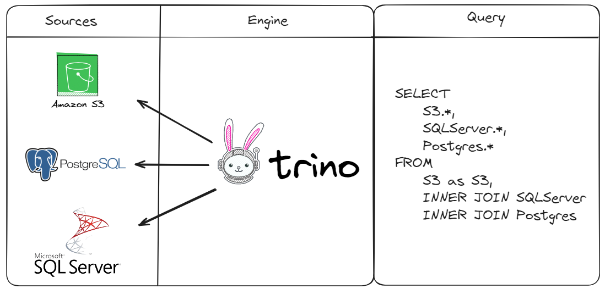

# Federated Query with Trino

## Description
This project aims to manage customer data including customer registration, purchases, and complaints. It consists of three main components:

| Component            | Description                                                                                      |
|----------------------|--------------------------------------------------------------------------------------------------|
| Customer Registration | Manages customer information such as name, email, and registration date.                         |
| Customer Purchases   | Tracks customer purchases including product ID, purchase date, and customer ID.                   |
| Customer Complaints  | Records complaints made by customers, linking them to the corresponding purchase and customer.   |

## Tutorial 
Link: https://youtu.be/b5jug57mStg

## Setup
### Database Setup
* PostgreSQL: Create a database named customer_management and run the SQL script to create the CustomerComplaints table.
* SQL Server: Create a database named customer_management and execute the SQL script to create the CustomerRegistration table.
* S3/Minio: Create a Hive table named CustomerPurchases in the gold schema to store purchase data.

## Usage
Insert data into the respective tables using the provided SQL scripts.
Execute the provided queries to perform operations such as retrieving customer data or resolving complaints.

## Project Structure
query: Contains SQL scripts to create tables and insert data.   

## Developer

### Contact

E-mail: wallacecpdg@gmail.com

Phone: + 351 926 802 230

### Social Media

[Linkedin](https://www.linkedin.com/in/wallace-camargo-35b615171/) 

[Youtube](https://www.youtube.com/@wallacecamargo1043/videos) 

[Github](https://github.com/wlcamargo) 

[Instagram](https://www.instagram.com/wlcamargo/) 

## References

https://trino.io/